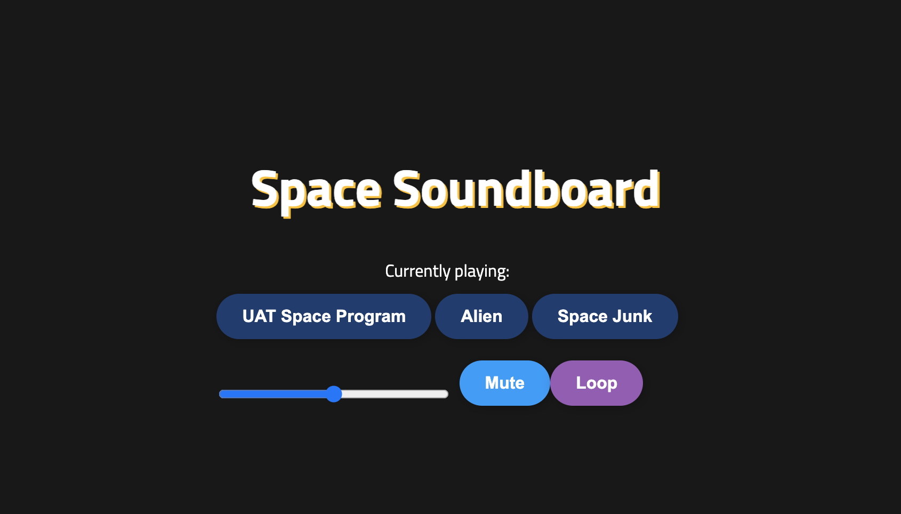

# Getting Started
Space Soundboard is a simple web application that allows you to play `space-themed` sound effects and music. It features three tracks that you can play, a volume slider, mute button, loop button, and stop button.

> To use the Space Soundboard, simply click on any of the buttons to play the corresponding sound effect. 

# Design
The Space Soundboardfeatures a modern and sleek design with a dark color scheme and animated space-themed buttons. The buttons are animated to move slowly when the cursor is not hovering over them and to move faster when the cursor hovers over them. The title text is also animated with a shaking effect.

# Usage
Click on one of the play buttons to start playing a track.
Use the volume slider to adjust the volume of the track.
Click the mute button to mute the track. Click it again to unmute.
Click the loop button to loop the track. Click it again to unloop.
Click the stop button to stop the currently playing track.

Sure, here's a sample README file for the Space Soundboard project:

Space Soundboard
Space Soundboard is a simple web application that allows you to play space-themed sound effects and music. It features three tracks that you can play, a volume slider, mute button, loop button, and stop button.

# Technologies Used
* HTML
* CSS
* JavaScript

# Contributing
`Contributions` are always welcome! If you have any suggestions or ideas for improving the Space Soundboard, please feel free to submit a pull request.

# LICENSE
**Open to Experiment**

BY:ROBERT SMITH

CREDIT: University of Advancing Tech

EMAIL - Robertsdev8@gmail.com for Colloboration 